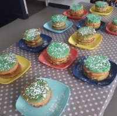

# Ateliers enfants

## Design Culinaire

L’atelier est une nouvelle expérience créative à travers un cour de cuisine original. Des sculptures de riz à la tasse en cookies... 
 
## De la magie dans l’art

A travers des ateliers artistiques et scientifiques les enfants vont créer comme par magie. (popups, l’ardoise magique… )

## Atelier des Artistes

Créer des projets artistiques en s’inspirant d’artiste. Engager de nouveaux moyens d’expression à travers de nouveaux mediums et découvrir de nouvelle façon de les utiliser de la peinture au pistolet de Niki Saint Phalle au photomontage d’Hanna Hoch. 

 
## Création livre « Ou suis-je ? »

A travers chaque page, une découverte de plusieurs techniques artistiques. 
 
## Stop motion

Le Stop-motion est une technique d'animation qui donne l’illusion de faire bouger les images. Le procédé consiste, par un défilé d'images fixes à donner l’impression d’un mouvement, simulé par le déplacement des objets ou des personnages. 
                                                                                    
## Modelage/Sculpture

Initiation aux arts du modelage, du moulage et de l’assemblage.
 
# Découverte des Arts Visuels

A partir d’une histoire et des jeux on découvre comment utiliser différents mediums. (Peinture, encre, fusain…)